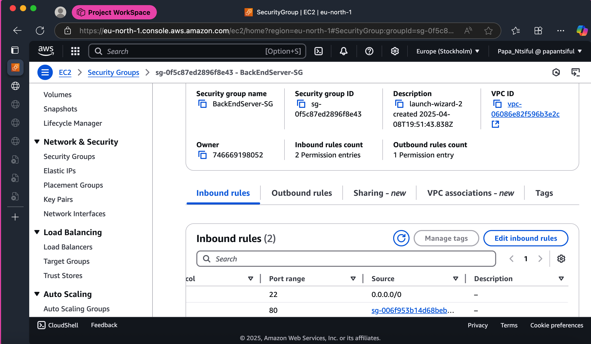

# NGINX Load Balancer Implementation on AWS


## Table of Contents
- [Project Overview](#project-overview)
- [System Architecture](#system-architecture)
- [Prerequisites](#prerequisites)
- [Quick Start Guide](#quick-start-guide)
- [Implementation Steps](#implementation-steps)
- [Load Balancing Methods Tested](#load-balancing-methods-tested)
- [Testing and Verification](#testing-and-verification)
- [Key Configuration Elements Explained](#key-configuration-elements-explained)
- [Troubleshooting](#troubleshooting)
- [Conclusion](#conclusion)
- [Future Improvements](#future-improvements)
- [Project Files and Directory Structure](#project-files-and-directory-structure)
- [License](#license)
- [Contact](#contact)

## Project Overview

This project demonstrates the implementation of NGINX as a load balancer on AWS to distribute traffic across multiple backend web servers. The setup consists of one master server acting as the load balancer and three backend servers handling web requests. This architecture provides high availability, improved performance through load distribution, and fault tolerance.

## System Architecture

```
                         ┌─────────────────┐
                         │                 │
                         │ Master Server   │
                         │ (NGINX LB)      │
                         │                 │
                         └────────┬────────┘
                                  │
                ┌────────────┬────┴────┬────────────┐
                │            │         │            │
                ▼            ▼         ▼            ▼
        ┌───────────┐ ┌───────────┐ ┌───────────┐
        │ Backend 1 │ │ Backend 2 │ │ Backend 3 │
        │ Weight: 3 │ │ Weight: 2 │ │ Weight: 1 │
        └───────────┘ └───────────┘ └───────────┘
```


## Prerequisites

- AWS account with permissions to create EC2 instances
- Basic knowledge of NGINX configuration
- SSH client for connecting to EC2 instances
- Understanding of network security concepts

## Quick Start Guide

1. Launch 4 EC2 instances (Ubuntu recommended)
2. Configure security groups as described in section 3
3. Apply the user-data script to backend servers during launch
4. SSH into the master server and install NGINX
5. Create the load balancer configuration file
6. Test the setup using the commands in the Testing section

## Implementation Steps

### 1. AWS Infrastructure Setup

Four EC2 instances were provisioned with the following roles:
- One master server configured as an NGINX load balancer
- Three backend web servers to handle incoming requests

All instances were assigned to appropriate security groups to control network access.


### 2. Backend Server Configuration

Each backend server was configured using the following user data script to ensure identical setup across all servers:

```bash
#!/bin/bash

# System updates and Nginx setup
apt-get update -y && apt-get upgrade -y
apt-get install nginx -y
systemctl start nginx && systemctl enable nginx

# Get IMDSv2 token (valid for 6 hours)
TOKEN=$(curl -X PUT "http://169.254.169.254/latest/api/token" -H "X-aws-ec2-metadata-token-ttl-seconds: 21600" -s)

# Retrieve metadata using IMDSv2
INSTANCE_ID=$(curl -H "X-aws-ec2-metadata-token: $TOKEN" -s http://169.254.169.254/latest/meta-data/instance-id)
INSTANCE_TYPE=$(curl -H "X-aws-ec2-metadata-token: $TOKEN" -s http://169.254.169.254/latest/meta-data/instance-type)
AZ=$(curl -H "X-aws-ec2-metadata-token: $TOKEN" -s http://169.254.169.254/latest/meta-data/placement/availability-zone)
PRIVATE_IP=$(curl -H "X-aws-ec2-metadata-token: $TOKEN" -s http://169.254.169.254/latest/meta-data/local-ipv4)
PUBLIC_IP=$(curl -H "X-aws-ec2-metadata-token: $TOKEN" -s http://169.254.169.254/latest/meta-data/public-ipv4 || echo "N/A")
SIGNATURE=$(curl -H "X-aws-ec2-metadata-token: $TOKEN" -s http://169.254.169.254/latest/dynamic/instance-identity/signature)

# Create 3D-styled HTML page
HTML_FILE="/var/www/html/index.html"

cat << EOF > $HTML_FILE
<!DOCTYPE html>
<html>
<head>
    <title>LB Test Node - $INSTANCE_ID</title>
    <style>
        body {
            background: linear-gradient(135deg, #1a1a1a 0%, #4a4a4a 100%);
            height: 100vh;
            margin: 0;
            display: flex;
            justify-content: center;
            align-items: center;
            perspective: 1000px;
            font-family: 'Arial Black', Gadget, sans-serif;
        }

        .card {
            background: linear-gradient(45deg, #ffffff, #f8f9fa);
            padding: 3rem;
            border-radius: 20px;
            transform: rotateX(10deg) rotateY(-10deg) rotateZ(2deg);
            box-shadow: 20px 20px 60px rgba(0,0,0,0.5),
                       -5px -5px 15px rgba(255,255,255,0.1);
            border: 2px solid rgba(255,255,255,0.15);
            text-shadow: 2px 2px 4px rgba(0,0,0,0.1);
            transition: transform 0.5s;
            max-width: 800px;
        }

        .card:hover {
            transform: rotateX(0deg) rotateY(0deg) rotateZ(0deg);
        }

        h1 {
            color: #2c3e50;
            font-size: 2.5rem;
            margin-bottom: 2rem;
            text-align: center;
            letter-spacing: 2px;
            text-transform: uppercase;
            border-bottom: 3px solid #2980b9;
            padding-bottom: 1rem;
        }

        .metadata {
            font-size: 1.4rem;
            color: #34495e;
            line-height: 2;
            text-align: left;
        }

        strong {
            color: #2980b9;
            font-weight: 900;
            letter-spacing: 1px;
        }

        .token {
            font-family: monospace;
            font-size: 1rem;
            word-break: break-all;
            background: rgba(0,0,0,0.05);
            padding: 1rem;
            border-radius: 5px;
            margin-top: 1rem;
        }
    </style>
</head>
<body>
    <div class="card">
        <h1>Load Balancer Test Node</h1>
        <div class="metadata">
            <p><strong>Instance ID:</strong> $INSTANCE_ID</p>
            <p><strong>Instance Type:</strong> $INSTANCE_TYPE</p>
            <p><strong>Availability Zone:</strong> $AZ</p>
            <p><strong>Private IP:</strong> $PRIVATE_IP</p>
            <p><strong>Public IP:</strong> $PUBLIC_IP</p>
            <div class="token">
                <strong>Instance Identity Token:</strong><br>
                $SIGNATURE
            </div>
        </div>
    </div>
</body>
</html>
EOF

# Set permissions and restart Nginx
chmod 644 $HTML_FILE
systemctl restart nginx
```

This script:
- Updates the package repository
- Auto-installs Nginx
- Creates a custom index.html file that displays instance metadata (ID, type, AZ, IPs)  
- Interactive 3D card design with hover effects  
- Secure IMDSv2 token-based AWS metadata retrieval  
- Ready in <60s - just add to instance user-data  

### 3. Security Group Configuration

Security groups were configured to control access to the instances:

1. **Master Load Balancer Security Group**:
   - Inbound: Allow HTTP (port 80) from anywhere
   - Outbound: Allow all traffic to backend server security group

2. **Backend Servers Security Group**:
   - Initially: Allow HTTP (port 80) from anywhere for testing
   - Final: Allow HTTP (port 80) only from master load balancer
   - Outbound: Allow all traffic



### 4. Backend Server Testing

Each backend server was individually tested to confirm proper operation before implementing the load balancer:

1. Direct access to each backend server was verified by accessing their public IP addresses
2. After confirming functionality, security groups were modified to restrict direct access


### 5. Load Balancer Configuration

On the master server, NGINX was configured as a load balancer using the following configuration file:

```nginx
# Define upstream backend servers - Configuration block for load balancing
upstream backend_servers {
    #load balancing method (default is round-robin)
    #least_conn;  # Distributes load based on least connections
    #ip_hash;  # Optional: Use IP hash for session persistence
    #weighted round-robin;  # Optional: Use weighted round-robin for load balancing
    
    # List of backend servers with failure detection settings
    server 172.31.33.139:80 max_fails=3 fail_timeout=30s weight=3;
    server 172.31.33.219:80 max_fails=3 fail_timeout=30s weight=2;
    server 172.31.32.170:80 max_fails=3 fail_timeout=30s weight=1;
    
    # Enable keepalive connections to backend servers
    keepalive 32;
}

# Upstream block explanation:
# This block configures load balancing across multiple backend servers
# - Uses least_conn algorithm to distribute traffic based on active connections
# - Defines 3 backend servers with health monitoring (max 3 fails, 30s timeout)
# - Enables keepalive with 32 connections per worker process
# - Provides high availability and fault tolerance

# Main server configuration block
server {
        
    # Load balancing configuration
    # Basic server settings
    listen 80;
    server_name _;  # Accepts any server name
    
    # Logging configuration
    access_log /var/log/nginx/access.log combined buffer=512k flush=1m;
    error_log /var/log/nginx/error.log warn;
    
    # Main proxy configuration
    location / {
        # Route requests to backend servers
        proxy_pass http://backend_servers;
        
        # Standard proxy headers for request forwarding
        proxy_set_header Host $host;
        proxy_set_header X-Real-IP $remote_addr;
        proxy_set_header X-Forwarded-For $proxy_add_x_forwarded_for;
        proxy_set_header X-Forwarded-Proto $scheme;
        
        # Timeout settings for proxy connections
        proxy_connect_timeout 60s;
        proxy_send_timeout 60s;
        proxy_read_timeout 60s;
        
        # Buffer configuration for proxy responses
        proxy_buffering on;
        proxy_buffer_size 4k;
        proxy_buffers 8 16k;
        proxy_busy_buffers_size 32k;
        
        # HTTP protocol and connection settings
        proxy_http_version 1.1;
        proxy_set_header Connection "";
    }
    
    # Health check endpoint configuration
    location /health {
        access_log off;
        return 200 'healthy\n';
        add_header Content-Type text/plain;
    }
}

# Server block explanation:
# This block defines the main NGINX server configuration
# - Listens on port 80 for all hostnames
# - Configures access and error logging with buffering
# - Sets up reverse proxy with header forwarding
# - Implements connection timeouts and response buffering
# - Provides a health check endpoint at /health
# - Optimizes for HTTP/1.1 with keepalive connections
```

This configuration was saved at `/etc/nginx/sites-available/nginx-load-balancer.conf` and enabled with:

```bash
sudo ln -s /etc/nginx/sites-available/nginx-load-balancer.conf /etc/nginx/sites-enabled/
sudo nginx -t  # Test the configuration
sudo systemctl reload nginx  # Apply the configuration
```

## Load Balancing Methods Tested

Four different load balancing methods were tested and verified for functionality:

### 1. Round-Robin (Default)

The default load balancing method that distributes requests sequentially across all backend servers.

**Configuration:**
```nginx
upstream backend_servers {
    server 172.31.33.139:80 max_fails=3 fail_timeout=30s;
    server 172.31.33.219:80 max_fails=3 fail_timeout=30s;
    server 172.31.32.170:80 max_fails=3 fail_timeout=30s;
    keepalive 32;
}
```

### 2. Least Connections

Directs traffic to the server with the fewest active connections, useful when request processing times vary.

**Configuration:**
```nginx
upstream backend_servers {
    least_conn;
    server 172.31.33.139:80 max_fails=3 fail_timeout=30s;
    server 172.31.33.219:80 max_fails=3 fail_timeout=30s;
    server 172.31.32.170:80 max_fails=3 fail_timeout=30s;
    keepalive 32;
}
```

### 3. IP Hash

Uses the client's IP address to determine which server receives the request, ensuring session persistence.

**Configuration:**
```nginx
upstream backend_servers {
    ip_hash;
    server 172.31.33.139:80 max_fails=3 fail_timeout=30s;
    server 172.31.33.219:80 max_fails=3 fail_timeout=30s;
    server 172.31.32.170:80 max_fails=3 fail_timeout=30s;
    keepalive 32;
}
```

### 4. Weighted Round-Robin

Distributes requests proportionally based on assigned server weights.

**Configuration:**
```nginx
upstream backend_servers {
    server 172.31.33.139:80 max_fails=3 fail_timeout=30s weight=3;
    server 172.31.33.219:80 max_fails=3 fail_timeout=30s weight=2;
    server 172.31.32.170:80 max_fails=3 fail_timeout=30s weight=1;
    keepalive 32;
}
```

## Testing and Verification

### Individual Backend Server Testing

Initial testing of each backend server was performed to ensure they were properly configured and responding:

- Each server was accessed directly via its IP address
- The custom HTML page confirmed the server identity by displaying its hostname and IP


### Security Group Validation

After adjusting security groups to restrict direct access to backend servers:

- Direct access attempts to backend servers failed as expected
- Access through the load balancer remained functional


### Load Balancer Testing

The load balancer was tested by sending multiple requests and verifying distribution to backend servers:

```bash
for i in {1..20}; do curl -s http://<load-balancer-ip> | grep "Instance ID"; done
```

This confirmed that requests were being properly distributed according to the configured load balancing method.


## Key Configuration Elements Explained

### Upstream Module

The `upstream` directive creates a named pool of backend servers:

- **server**: Defines a backend server with its IP address and port
- **max_fails**: Number of failed connection attempts before marking a server as unavailable
- **fail_timeout**: Duration for which a server is considered unavailable after max_fails is reached
- **weight**: Relative weight for load balancing (higher values receive more traffic)
- **keepalive**: Number of idle keepalive connections maintained per worker process

### Proxy Configuration

The proxy settings control request forwarding:

- **proxy_pass**: Specifies where to forward requests
- **proxy_set_header**: Sets request headers before forwarding
- **proxy_connect_timeout**: Sets timeout for establishing connections
- **proxy_send_timeout**: Sets timeout for sending data
- **proxy_read_timeout**: Sets timeout for reading responses

### Health Check Endpoint

A dedicated health check endpoint provides a way to monitor load balancer status:

```nginx
location /health {
    access_log off;
    return 200 'healthy\n';
    add_header Content-Type text/plain;
}
```

## Troubleshooting

Common issues and their solutions:

- **Backend servers not receiving traffic**: Check security group rules and NGINX configuration
- **NGINX configuration test fails**: Verify syntax in the configuration file
- **Load balancer not distributing traffic as expected**: Confirm the chosen load balancing method is properly configured
- **Connection timeouts**: Check network connectivity between load balancer and backend servers
- **HTTP 502 Bad Gateway errors**: Ensure backend servers are running and accessible from the load balancer

## Conclusion

This project successfully demonstrated the implementation of NGINX as a load balancer across multiple backend servers. All four load balancing methods (round-robin, least connections, IP hash, and weighted round-robin) were tested and confirmed to work as expected.

The implementation provides:

1. **High Availability**: Traffic is automatically redirected if a backend server fails
2. **Scalability**: The architecture allows easy addition of more backend servers
3. **Optimized Performance**: Traffic is intelligently distributed across available resources
4. **Fault Tolerance**: Failure detection prevents routing requests to unavailable servers

## Future Improvements

Potential enhancements for this setup include:

1. **SSL/TLS Implementation**: Adding HTTPS support with Let's Encrypt
2. **Advanced Health Checks**: Implementing more sophisticated health monitoring
3. **Rate Limiting**: Adding protection against traffic spikes
4. **Content Caching**: Implementing caching at the load balancer level
5. **Monitoring Integration**: Setting up Prometheus/Grafana for real-time monitoring
6. **Auto-scaling**: Dynamically adding backend servers based on load

## Project Files and Directory Structure

All project files and documentation are available in the repository with the following structure:

```
/
├── README.md                     # This documentation file
├── imgs/                         # Directory for all images
│   ├── architecture/             # System architecture diagrams
│   │   └── load-balancer-architecture.png
│   ├── setup/                    # Setup screenshots
│   │   ├── ec2-instances.png
│   │   └── security-groups.png
│   └── testing/                  # Testing screenshots
│       ├── backend-server-direct-access/
│       │   ├── Screenshot 2025-04-08 at 22.01.09.png
│       │   ├── Screenshot 2025-04-08 at 22.01.22.png
│       │   └── Screenshot 2025-04-08 at 22.01.43.png
│       ├── security-group-test/
│       │   ├── Screenshot 2025-04-08 at 22.01.56.png
│       │   ├── Screenshot 2025-04-08 at 22.02.05.png
│       │   └── Screenshot 2025-04-08 at 22.02.17.png
│       └── load-balancer-test/
│           ├── Screenshot 2025-04-09 at 09.02.15.png
│           ├── Screenshot 2025-04-09 at 09.02.28.png
│           └── Screenshot 2025-04-09 at 09.03.37.png
├── configs/
│   └── nginx-load-balancer.conf  # NGINX load balancer configuration file
└── scripts/
    └── user-data-nginx-setup.sh  # User data script for backend servers
```

All project screenshots are available in the [imgs directory](https://github.com/yourusername/nginx-load-balancer/tree/main/imgs).

The complete configuration files can be found in the [configs directory](https://github.com/yourusername/nginx-load-balancer/tree/main/configs).

## License

This project is licensed under the MIT License - see the LICENSE file for details.

## Contact

For questions or feedback about this project, please [open an issue](https://github.com/matthewntsiful/nginx-load-balancer/issues) or contact [matthew.ntsiful@gmail.com].